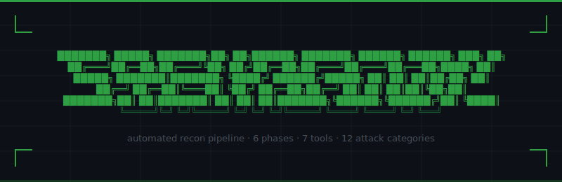
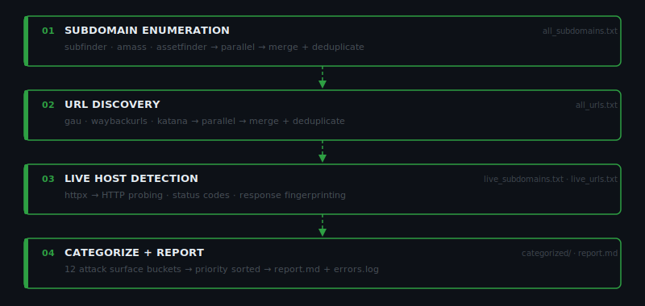
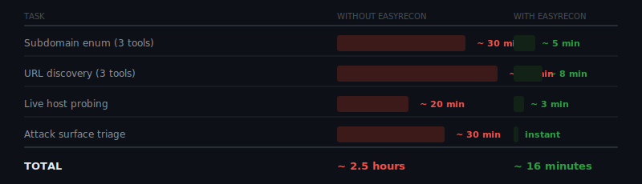
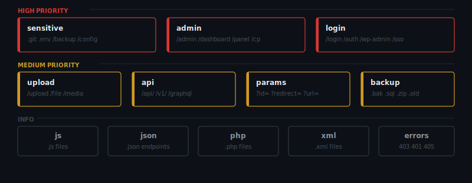
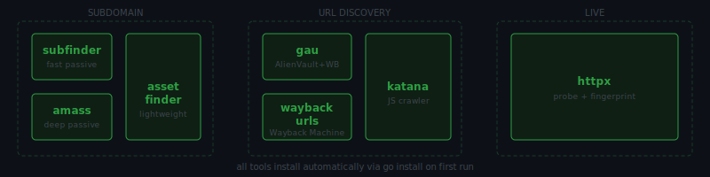

<div align="center">
  
  <br/><br/>

  
  
  
  
  
  
  
</div>

---

## What is easyrecon?

Recon is the most time-consuming part of any bug bounty or pentest engagement. Most hunters still chain tools manually — run subfinder, merge with amass, feed into gau, probe with httpx, then grep through thousands of URLs hunting for `/admin`, `.env`, `?redirect=`. That's hours of setup before you've touched a single vulnerability.

easyrecon eliminates that entirely. It orchestrates **7 industry-standard tools** across **6 phases**, runs them in parallel, merges and deduplicates results, categorizes your entire attack surface into **12 priority buckets**, and writes a full report — automatically.

```
$ easyrecon target.com
```

---

## Pipeline



---

## Time Saved



> Tools run in parallel per phase. 3x faster than sequential execution.

---

## Attack Surface Categories



---

## Tools



---

## Installation

**Requirements:** Python 3.8+ · Go

```bash
git clone https://github.com/unrealsrabon/easyrecon
cd easyrecon
chmod +x install.sh
./install.sh
```

The install script checks dependencies, installs all 7 tools via `go install`, installs Python packages, and configures a universal `easyrecon` command. Nothing manual.

Installer behavior (automatic):
- Creates project `.venv` and installs Python dependencies there (`rich`, `pyfiglet`, `pyyaml`)
- Installs a global launcher at `~/.local/bin/easyrecon`
- Launcher always uses the project `.venv` Python, so UI stays consistent
- Adds `~/.local/bin` and `~/go/bin` to shell PATH when missing

After install, you can run from anywhere:

```bash
easyrecon --version
easyrecon target.com
```

---

## Usage

```bash
easyrecon target.com                        # full pipeline

easyrecon target.com --phase subdomain      # single phase
easyrecon target.com --phase urls
easyrecon target.com --phase live
easyrecon target.com --phase categorize
easyrecon target.com --phase report

easyrecon target.com --timeout 1200         # override timeouts (seconds)
easyrecon target.com -nt                    # disable process timeouts for this run
easyrecon target.com --output ~/results     # custom output dir
easyrecon target.com --config custom.yaml   # custom config
easyrecon target.com --no-install           # skip install check
```

For very large targets, use `-nt` to allow full long-running collection without process timeout.

---

## Output Structure

```
results/
└── target.com_2026-03-26_04-20/
    ├── raw/                    ← raw output per tool
    │   ├── subfinder.txt
    │   ├── amass.txt
    │   ├── assetfinder.txt
    │   ├── gau.txt
    │   ├── waybackurls.txt
    │   └── katana.txt
    ├── processed/              ← merged + deduplicated
    │   ├── all_subdomains.txt
    │   ├── live_subdomains.txt
    │   ├── all_urls.txt
    │   └── live_urls.txt
    ├── categorized/            ← sorted by attack surface
    │   ├── sensitive.txt
    │   ├── admin.txt
    │   ├── api.txt
    │   ├── params.txt
    │   └── ...
    ├── report.md
    └── errors.log
```

---

## Configuration

```bash
cp easyrecon.yaml ~/.easyrecon.yaml
```

```yaml
tools:
  amass:
    enabled: false
  subfinder:
    timeout: 300
    extra_args: "-recursive"

settings:
  output_dir: "~/results"
  threads: 50
  auto_install: true
  default_timeout: 600
```

Config priority: `--config` > `./easyrecon.yaml` > `~/.easyrecon.yaml` > defaults

---

## Legal

Only use easyrecon on targets you own or have **explicit written permission** to test.
Unauthorized scanning is illegal in most jurisdictions. You are solely responsible for your actions.

---

## Contributing

Pull requests welcome. Open an issue first to discuss changes.

---

## License

MIT — see [LICENSE](LICENSE)

---

<div align="center">

Made by [@unrealsrabon](https://github.com/unrealsrabon) · Part of the [ai-will-replace-developers](https://github.com/ai-will-replace-developers) project

</div>
